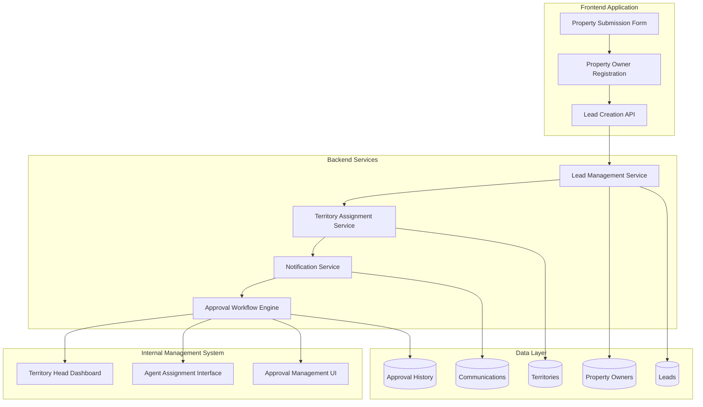

# Design Document: Frontend-Backend Property Synchronization System

## Overview

This design document outlines the comprehensive frontend-backend synchronization system for the GoRoomz platform. The system enables seamless property creation, owner management, and lead approval workflows between the public-facing frontend application and the internal management system.

The system integrates property owner creation from the frontend with the existing lead management system, triggering appropriate approval workflows involving Territory Heads, Superusers, Platform Heads, Operation Heads, and Agents while maintaining data consistency across both applications.

## Architecture

### High-Level Architecture



### System Components

1. **Frontend Property Submission System**
   - Enhanced PropertyListingWizard component
   - Property owner registration flow
   - Lead tracking dashboard

2. **Backend Lead Management Service**
   - Lead creation and validation
   - Territory-based assignment
   - Approval workflow orchestration

3. **Internal Management Interface**
   - Lead review and assignment tools
   - Communication tracking
   - Approval decision interfaces

4. **Notification and Communication System**
   - Real-time notifications
   - Email notifications
   - In-app messaging

5. **Data Synchronization Layer**
   - Real-time data sync between systems
   - Conflict resolution
   - Audit logging

## Components and Interfaces

### Frontend Components

#### Enhanced PropertyListingWizard
```typescript
interface PropertySubmissionData {
  // Property Information
  propertyDetails: {
    name: string;
    description: string;
    type: 'hotel' | 'pg' | 'homestay' | 'apartment';
    estimatedRooms: number;
    category: string;
  };
  
  // Location Information
  location: {
    address: string;
    city: string;
    state: string;
    country: string;
    pincode?: string;
    landmark?: string;
  };
  
  // Owner Information
  owner: {
    name: string;
    email: string;
    phone: string;
    businessName?: string;
  };
  
  // Additional Details
  amenities: string[];
  images: PropertyImage[];
  expectedLaunchDate?: Date;
  notes?: string;
}
```

#### Property Owner Registration Component
```typescript
interface PropertyOwnerRegistration {
  personalInfo: {
    name: string;
    email: string;
    phone: string;
    dateOfBirth?: Date;
  };
  
  businessInfo: {
    businessName?: string;
    businessType: 'individual' | 'company' | 'partnership';
    gstNumber?: string;
  };
  
  address: {
    address: string;
    city: string;
    state: string;
    country: string;
    pincode: string;
  };
  
  preferences: {
    communicationPreferences: ('email' | 'sms' | 'phone')[];
    marketingConsent: boolean;
  };
}
```

#### Lead Tracking Dashboard
```typescript
interface LeadTrackingData {
  leadId: string;
  status: LeadStatus;
  submissionDate: Date;
  lastUpdated: Date;
  assignedAgent?: AgentInfo;
  territory?: TerritoryInfo;
  communications: CommunicationRecord[];
  nextSteps: string[];
  estimatedApprovalDate?: Date;
}
```

### Backend Services

#### Lead Management Service
```typescript
interface LeadService {
  createLead(data: PropertySubmissionData): Promise<Lead>;
  assignToTerritory(leadId: string): Promise<Territory>;
  updateLeadStatus(leadId: string, status: LeadStatus, reason?: string): Promise<Lead>;
  getLeadsByTerritory(territoryId: string): Promise<Lead[]>;
  getLeadsByAgent(agentId: string): Promise<Lead[]>;
  escalateLead(leadId: string, reason: string): Promise<Lead>;
}
```

#### Territory Assignment Service
```typescript
interface TerritoryService {
  assignLeadToTerritory(leadId: string, location: LocationData): Promise<Territory>;
  getAvailableAgents(territoryId: string): Promise<Agent[]>;
  assignLeadToAgent(leadId: string, agentId: string): Promise<void>;
  getWorkloadDistribution(territoryId: string): Promise<WorkloadData>;
}
```

#### Approval Workflow Engine
```typescript
interface ApprovalWorkflow {
  initiateApproval(leadId: string): Promise<ApprovalProcess>;
  processApprovalDecision(leadId: string, decision: ApprovalDecision): Promise<void>;
  escalateToNextLevel(leadId: string): Promise<void>;
  createPropertyOwnerAccount(leadId: string): Promise<PropertyOwner>;
  createPropertyListing(leadId: string): Promise<Property>;
}
```

### Internal Management Interfaces

#### Lead Review Interface
```typescript
interface LeadReviewData {
  lead: Lead;
  propertyDetails: PropertySubmissionData;
  ownerVerificationStatus: VerificationStatus;
  marketAnalysis: MarketData;
  riskAssessment: RiskScore;
  recommendedAction: RecommendedAction;
}
```

#### Agent Assignment Interface
```typescript
interface AgentAssignmentData {
  availableAgents: Agent[];
  workloadDistribution: WorkloadData;
  performanceMetrics: AgentPerformance[];
  autoAssignmentRules: AssignmentRule[];
}
```

## Data Models

### Lead Model (Enhanced)
```typescript
interface Lead {
  id: string;
  
  // Property Information
  propertyOwnerName: string;
  email: string;
  phone: string;
  businessName?: string;
  propertyType: 'hotel' | 'pg' | 'homestay' | 'apartment';
  estimatedRooms: number;
  
  // Location
  address: string;
  city: string;
  state: string;
  country: string;
  pincode?: string;
  landmark?: string;
  
  // Lead Management
  status: LeadStatus;
  source: string;
  agentId?: string;
  territoryId?: string;
  approvedBy?: string;
  rejectionReason?: string;
  
  // Workflow Tracking
  submissionDate: Date;
  lastContactDate?: Date;
  expectedCloseDate?: Date;
  approvalDate?: Date;
  
  // Additional Data
  notes?: string;
  priority: 'low' | 'medium' | 'high' | 'urgent';
  tags: string[];
  
  // Sync Tracking
  frontendSubmissionId?: string;
  syncStatus: 'pending' | 'synced' | 'failed';
  lastSyncAt?: Date;
}
```

### Property Owner Model (Enhanced)
```typescript
interface PropertyOwner {
  id: string;
  
  // Personal Information
  name: string;
  email: string;
  phone: string;
  dateOfBirth?: Date;
  
  // Business Information
  businessName?: string;
  businessType: 'individual' | 'company' | 'partnership';
  gstNumber?: string;
  
  // Address
  address: string;
  city: string;
  state: string;
  country: string;
  pincode: string;
  
  // Account Status
  role: 'owner';
  isVerified: boolean;
  verificationDocuments: Document[];
  
  // Preferences
  communicationPreferences: ('email' | 'sms' | 'phone')[];
  notificationSettings: NotificationSettings;
  
  // Platform Integration
  leadId?: string; // Reference to originating lead
  onboardingStatus: 'pending' | 'in_progress' | 'completed';
  onboardingDate?: Date;
  
  // Subscription and Billing
  subscriptionType?: 'commission' | 'subscription';
  paymentPreferences: PaymentPreferences;
}
```

### Communication Record Model
```typescript
interface CommunicationRecord {
  id: string;
  leadId: string;
  userId: string; // Agent or staff member
  
  type: 'call' | 'email' | 'meeting' | 'note' | 'sms';
  subject?: string;
  content: string;
  
  // Scheduling
  scheduledAt?: Date;
  completedAt?: Date;
  
  // Metadata
  direction: 'inbound' | 'outbound';
  status: 'scheduled' | 'completed' | 'cancelled' | 'no_response';
  
  // Attachments
  attachments: Attachment[];
  
  // Tracking
  createdAt: Date;
  updatedAt: Date;
}
```

### Booking Synchronization Model
```typescript
interface BookingSync {
  id: string;
  
  // Booking Information
  bookingId: string;
  propertyId: string;
  propertyOwnerId: string;
  
  // Customer Information
  customerId: string;
  customerName: string;
  customerEmail: string;
  customerPhone: string;
  
  // Booking Details
  checkInDate: Date;
  checkOutDate: Date;
  roomType: string;
  bedId?: string;
  guestCount: number;
  
  // Pricing
  baseAmount: number;
  taxes: TaxBreakdown;
  serviceCharges: ServiceChargeBreakdown;
  totalAmount: number;
  
  // Payment
  paymentStatus: 'pending' | 'partial' | 'completed' | 'refunded';
  paymentMethod: string;
  transactionId?: string;
  
  // Sync Status
  syncStatus: 'pending' | 'synced' | 'failed';
  lastSyncAt: Date;
  syncErrors?: string[];
  
  // Notifications
  ownerNotified: boolean;
  customerNotified: boolean;
  notificationsSent: NotificationLog[];
}
```

### Payment Integration Models
```typescript
interface PaymentTransaction {
  id: string;
  bookingId: string;
  
  // Payment Details
  amount: number;
  currency: 'INR';
  paymentMethod: 'card' | 'upi' | 'netbanking' | 'wallet';
  
  // Gateway Information
  gatewayProvider: 'razorpay' | 'payu' | 'stripe';
  gatewayTransactionId: string;
  gatewayOrderId: string;
  
  // Status
  status: 'initiated' | 'processing' | 'completed' | 'failed' | 'refunded';
  failureReason?: string;
  
  // Tax and Commission
  hotelGST: number;
  serviceCharge: number;
  serviceChargeGST: number;
  platformCommission: number;
  netAmountToOwner: number;
  
  // Timestamps
  initiatedAt: Date;
  completedAt?: Date;
  refundedAt?: Date;
}

interface TaxBreakdown {
  hotelGSTRate: number; // 12% or 18% based on room rate
  hotelGSTAmount: number;
  serviceChargeGSTRate: number; // 18%
  serviceChargeGSTAmount: number;
  totalTax: number;
}

interface ServiceChargeBreakdown {
  serviceChargeRate: number; // Configurable percentage or fixed amount
  serviceChargeAmount: number;
  serviceChargeGST: number;
  totalServiceCharge: number;
}
```

## Correctness Properties

*A property is a characteristic or behavior that should hold true across all valid executions of a system-essentially, a formal statement about what the system should do. Properties serve as the bridge between human-readable specifications and machine-verifiable correctness guarantees.*

### Property-Based Testing Overview

Property-based testing (PBT) validates software correctness by testing universal properties across many generated inputs. Each property is a formal specification that should hold for all valid inputs.

Based on the prework analysis and property reflection to eliminate redundancy, the following properties have been identified:

**Property 1: Lead Creation Completeness**
*For any* valid property submission from the frontend, the system should create exactly one lead record in the internal system containing all submitted property details, owner information, and an accurate submission timestamp
**Validates: Requirements 1.1, 1.2**

**Property 2: Territory Assignment Accuracy**
*For any* lead with valid location information, the system should automatically assign it to the correct territory based on the property's city and state
**Validates: Requirements 1.3**

**Property 3: Comprehensive Notification Delivery**
*For any* system event that requires stakeholder notification (lead creation, assignment, status changes, bookings), the system should deliver notifications to all relevant parties through their preferred channels within the specified timeframes
**Validates: Requirements 1.4, 2.1, 2.4, 3.5, 4.1, 5.2, 8.2, 21.1, 21.4**

**Property 4: Status Update Consistency**
*For any* lead status change or assignment action, the system should update the lead status correctly and reflect the change across all interfaces (internal management, property owner dashboard) within 10 seconds
**Validates: Requirements 2.5, 3.4, 4.5, 8.2, 10.2**

**Property 5: Agent Assignment Workflow**
*For any* lead assignment to an agent, the system should update the assignment, set appropriate deadlines, notify the agent with complete lead information, and provide the territory head with workload visibility
**Validates: Requirements 3.1, 3.2, 3.3, 4.1**

**Property 6: Communication Logging Completeness**
*For any* communication between agents and property owners, the system should log the interaction in both the internal system and make it visible to supervisors with complete details
**Validates: Requirements 4.3, 10.3, 12.1, 12.2**

**Property 7: Superuser Override Authority**
*For any* superuser decision on a lead, the system should override previous decisions, update the lead status, and notify all relevant stakeholders of the final decision
**Validates: Requirements 5.4, 5.5**

**Property 8: Property Owner Account Creation**
*For any* property submission without an existing account, the system should automatically create a property owner account, collect all required information, send login credentials, and link the account to the submitted property
**Validates: Requirements 9.1, 9.2, 9.3, 9.4**

**Property 9: Account Linking for Existing Users**
*For any* property submission from an existing property owner account, the system should link the new property to the existing account without creating duplicate accounts
**Validates: Requirements 9.5**

**Property 10: Real-time Synchronization Timing**
*For any* data change in either the frontend or internal system, the system should synchronize the change to the other system within the specified timeframes (5 seconds for lead creation, 10 seconds for status updates, 5 seconds for booking changes)
**Validates: Requirements 10.1, 10.2, 22.3**

**Property 11: Conflict Resolution Priority**
*For any* data conflict between frontend and internal systems, the system should prioritize internal system data, apply the resolution, and log the conflict for administrative review
**Validates: Requirements 10.4**

**Property 12: Failure Recovery and Alerting**
*For any* synchronization failure, the system should automatically retry the operation and alert administrators if failures persist beyond the retry threshold
**Validates: Requirements 10.5, 22.5**

**Property 13: Booking Synchronization Completeness**
*For any* online booking, the system should create the booking record in property management, update availability in real-time, and display both online and offline bookings in unified interfaces
**Validates: Requirements 22.1, 22.2, 22.4**

**Property 14: Payment Gateway Integration**
*For any* payment transaction, the system should redirect to secure gateways, handle success/failure scenarios appropriately, store transaction details securely, and provide receipts
**Validates: Requirements 28.2, 28.3, 28.4, 28.5**

**Property 15: GST Calculation Compliance**
*For any* hotel booking, the system should calculate GST at the correct rate based on room tariff (12% for rooms below ₹7,500, 18% for rooms above ₹7,500), display pricing components separately, and include all required GST information in invoices
**Validates: Requirements 41.1, 41.2, 41.3, 41.4, 41.5**

**Property 16: Booking Notification Content Completeness**
*For any* booking notification, the system should include all required information (guest details, booking dates, room/bed information, payment status) and handle notification consolidation for multiple bookings
**Validates: Requirements 21.2, 21.3, 21.5**

**Property 17: Property Approval Workflow**
*For any* approved lead, the system should automatically create the property listing, create/link the property owner account, and notify the owner with next steps for listing activation
**Validates: Requirements 5.5, 8.4**

**Property 18: Rejection Feedback Completeness**
*For any* rejected property submission, the system should provide detailed feedback explaining the rejection reasons and clear options for resubmission
**Validates: Requirements 8.5**

**Property 19: Information Request Handling**
*For any* request for additional information from property owners, the system should clearly indicate what is needed and provide appropriate upload capabilities
**Validates: Requirements 8.3**

**Property 20: Lead Tracking Dashboard Accuracy**
*For any* property owner, the system should provide an accurate tracking dashboard showing current status, progress updates, and relevant communication history
**Validates: Requirements 8.1**

## Error Handling

### Error Categories and Handling Strategies

#### 1. Data Validation Errors
- **Frontend Validation**: Client-side validation for immediate feedback
- **Backend Validation**: Server-side validation for security and data integrity
- **Error Response Format**: Consistent error response structure with field-level validation messages

#### 2. Synchronization Errors
- **Retry Logic**: Exponential backoff for transient failures
- **Dead Letter Queue**: Failed synchronization events for manual review
- **Conflict Resolution**: Automated resolution with audit logging

#### 3. External Service Failures
- **Payment Gateway Failures**: Graceful degradation with retry mechanisms
- **Email Service Failures**: Fallback notification channels
- **SMS Service Failures**: Alternative communication methods

#### 4. Database Errors
- **Connection Failures**: Connection pooling and retry logic
- **Transaction Failures**: Rollback mechanisms and data consistency checks
- **Constraint Violations**: User-friendly error messages

#### 5. Authentication and Authorization Errors
- **Token Expiration**: Automatic token refresh
- **Permission Denied**: Clear error messages with suggested actions
- **Account Lockout**: Security measures with unlock procedures

### Error Recovery Mechanisms

#### Automatic Recovery
```typescript
interface AutoRecoveryConfig {
  maxRetries: number;
  retryDelay: number;
  exponentialBackoff: boolean;
  circuitBreakerThreshold: number;
}
```

#### Manual Recovery
```typescript
interface ManualRecoveryProcess {
  errorId: string;
  errorType: string;
  recoveryActions: RecoveryAction[];
  escalationPath: string[];
  timeoutThreshold: number;
}
```

## Testing Strategy

### Dual Testing Approach

The system will employ both unit testing and property-based testing to ensure comprehensive coverage:

#### Unit Tests
Unit tests will focus on:
- Specific examples that demonstrate correct behavior
- Edge cases and boundary conditions
- Error handling scenarios
- Integration points between components
- API endpoint functionality
- Database operations

#### Property-Based Tests
Property-based tests will verify universal properties across all inputs:
- Each correctness property will be implemented as a separate property-based test
- Minimum 100 iterations per property test to ensure comprehensive input coverage
- Each test will be tagged with: **Feature: frontend-backend-property-sync, Property {number}: {property_text}**
- Tests will use intelligent generators that constrain to valid input spaces

### Testing Framework Configuration

**Property-Based Testing Library**: fast-check (for TypeScript/JavaScript)
**Unit Testing Framework**: Jest with React Testing Library
**Integration Testing**: Supertest for API testing
**End-to-End Testing**: Playwright for full workflow testing

### Test Data Generation

#### Smart Generators
```typescript
// Property submission generator
const propertySubmissionGen = fc.record({
  propertyDetails: fc.record({
    name: fc.string({ minLength: 5, maxLength: 100 }),
    type: fc.constantFrom('hotel', 'pg', 'homestay', 'apartment'),
    estimatedRooms: fc.integer({ min: 1, max: 500 })
  }),
  location: fc.record({
    city: fc.constantFrom('Bangalore', 'Mumbai', 'Delhi', 'Chennai', 'Hyderabad'),
    state: fc.string({ minLength: 3, maxLength: 50 }),
    address: fc.string({ minLength: 10, maxLength: 200 })
  }),
  owner: fc.record({
    name: fc.string({ minLength: 2, maxLength: 50 }),
    email: fc.emailAddress(),
    phone: fc.string({ minLength: 10, maxLength: 15 })
  })
});

// GST calculation generator
const hotelBookingGen = fc.record({
  roomRate: fc.float({ min: 100, max: 50000 }),
  nights: fc.integer({ min: 1, max: 30 }),
  roomType: fc.constantFrom('standard', 'deluxe', 'suite')
});
```

### Test Coverage Requirements

- **Unit Test Coverage**: Minimum 80% code coverage
- **Property Test Coverage**: All 20 correctness properties must be implemented
- **Integration Test Coverage**: All API endpoints and critical workflows
- **End-to-End Test Coverage**: Complete user journeys from property submission to approval

### Performance Testing

#### Load Testing Scenarios
- Concurrent property submissions
- High-volume booking synchronization
- Peak notification delivery
- Database performance under load

#### Performance Benchmarks
- Lead creation: < 5 seconds
- Status synchronization: < 10 seconds
- Booking synchronization: < 5 seconds
- Notification delivery: < 30 seconds
- Payment processing: < 60 seconds

### Security Testing

#### Security Test Categories
- Input validation and sanitization
- Authentication and authorization
- Data encryption in transit and at rest
- Payment security compliance
- GDPR compliance for personal data

#### Penetration Testing
- SQL injection prevention
- Cross-site scripting (XSS) prevention
- Cross-site request forgery (CSRF) protection
- API security testing
- File upload security

### Monitoring and Observability

#### Application Monitoring
```typescript
interface MonitoringMetrics {
  leadCreationRate: number;
  synchronizationLatency: number;
  notificationDeliveryRate: number;
  errorRate: number;
  systemUptime: number;
}
```

#### Business Metrics
```typescript
interface BusinessMetrics {
  propertySubmissionRate: number;
  approvalRate: number;
  conversionRate: number;
  averageApprovalTime: number;
  customerSatisfactionScore: number;
}
```

#### Alerting Configuration
- Critical: System downtime, payment failures, data corruption
- Warning: High error rates, slow response times, sync delays
- Info: Business metrics, performance trends, usage patterns

This comprehensive testing strategy ensures that the frontend-backend property synchronization system maintains high reliability, performance, and correctness across all operational scenarios.